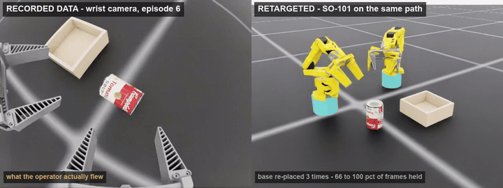

# OmniBase

**Where would the robot have to stand?**

A person demonstrating a task with a hand-held gripper does not think about a robot's reach.
Replay what they flew against a fixed-base arm and much of it is simply unreachable — not
because the arm is slow or the controller is bad, but because no joint angles exist.

OmniBase stops treating the base pose as a property of the robot. In a recording it is a **free
variable**: nothing in the data says where the robot was standing, because there was no robot.
So choose it — and choose it again whenever it stops working.

numpy and scipy. No simulator, no learned model, no rollout.

---



**Left: the data.** The wrist camera of a hand-held gripper, one episode, exactly as recorded.
**Right: the same data, retargeted.** Two SO-ARM101s driven to joint angles OmniBase solved for,
each standing where it says a base would have to stand. Frame-for-frame in sync — the recording
never changes, only the robot under it does. The base is re-placed three times, and across the
episode the arms hold 100% of frames where the best single fixed base holds 66%.

The render is Isaac Sim, and it is only a picture: OmniBase computed the placements and the
joint angles with the arithmetic in this repository, and never opened a simulator to do it.
[Full-resolution clip](docs/omnibase_demo.mp4). Both panels are at their native 480x360 — the
recording's own wrist-camera resolution — so nothing here has been upscaled into looking
sharper or blurrier than it is.

---

## The idea in one table

A policy never sees a whole episode at once. It sees an observation window and predicts an
action chunk — a couple of dozen frames. A base only has to be right for that long.

Measured on 16 episodes of a two-handed can-picking recording, retargeted to an SO-ARM101:

| one base must serve | right hand usable | left hand usable |
|---|---|---|
| the whole episode | 56% | 50% |
| 250 frames | 63% | 58% |
| 100 frames | 80% | 80% |
| 50 frames | 93% | 95% |
| **21 frames** (obs + action chunk) | **99.4%** | **100%** |

Shortening the commitment from "one base for the episode" to "one base per training window"
took the same recordings from roughly half usable to essentially all of it. Across all 32
episode/hand pairs, chunked retargeting held **100%** of frames; the best single fixed base
managed 61–100% depending on the episode.

Moving the base once already pays before any chunking. At the placement the teleop config
happened to use, 18% and 24% of frames were reachable. At the best single placement — 12 cm
back and 8 cm up — 76% and 73%.

---

## Install

```bash
pip install -e .
```

Requires Python 3.9+, numpy and scipy. `pandas` and `pyarrow` are only needed if you load
LeRobot datasets through `omnibase.load`.

---

## Use it on your data

The library only ever needs two arrays per hand: `pos` (N, 3) in metres and `quat` (N, 4) as
`(x, y, z, w)`, both in one fixed world frame. If you have those, everything below works.

```python
import omnibase as ob

chain = ob.so101()                                    # or build your own, see below
ep    = ob.load("datasets/mine", episode=6)           # LeRobot v2.1 or v3.0
pos, quat = ep.hands[0].pos, ep.hands[0].quat

cells  = ob.base_grid(span=0.42, step=0.02, height=0.08)
F      = ob.feasibility(chain, pos, quat, cells)
chunks, held = ob.chunk([F], cells, window=21)        # window = obs buffer + action chunk

print(f"{held.mean():.0%} of frames held across {len(chunks)} chunk(s)")
print("best single base: %.0f%%" % (100 * ob.best_fixed(F, cells)[1]))
for c in chunks:
    print(f"  frames {c.start:4d}-{c.stop:4d}  base {c.bases[0].round(3)}  held {c.held[0]:.0%}")
```

Pass several hands at once and they share one set of chunk boundaries — they are in one
recording, and a cut that lands mid-reach for the other hand is not a cut you can use:

```python
Fs = [ob.feasibility(chain, h.pos, h.quat, cells) for h in ep.hands]
chunks, held = ob.chunk(Fs, cells, window=21)
```

### Arms that cannot be placed separately

The above places each arm on its own. That is right for arms on separate stands and wrong for
almost every real bimanual robot: two arms on one torso, a humanoid, a pair bolted to the same
rail. There the spacing is hardware, and the only thing you choose is where the whole assembly
stands — so a placement that suits the right arm is no use if it strands the left one.

Place the assembly instead:

```python
mount = ob.pair(0.46)                                  # two arms, 0.46 m apart, one plate
cells = ob.mount_grid(span=0.34, step=0.02, height=0.08,
                      yaws=np.radians([-20, 0, 20]))   # a torso can turn, too
combined, per_arm = ob.mount_feasibility(chain, [(h.pos, h.quat) for h in ep.hands],
                                         mount, cells)
chunks, held = ob.chunk([combined], cells, window=21)  # one placement to choose, not two

for (p, rot) in ob.arm_bases(mount, chunks[0].bases[0]):
    print("bolt an arm at", p.round(3))
```

`combined[f, c]` is true only where **every** arm can hold frame `f`. For arms mounted at an
angle — shoulders usually are — give each offset as `(x, y, z, qx, qy, qz, qw)` and build the
`Mount` directly instead of using `pair`.

```bash
python -m omnibase plan datasets/mine --episode 6 --pair 0.46 --mount-yaw=-20,0,20
```
```
  rigid pair, 0.460 m apart -- placing the assembly, not the arms

  5 chunk(s); the assembly moves 4 time(s):
    chunk 1: frames   21-  72   mount (-0.05,+0.05,+0.08) yaw +0
                                -> right [-0.05, -0.18, 0.08]  left [-0.05, 0.28, 0.08]
                                both held 100.0%

  BOTH arms at once: chunked 71.1% of frames held, against 41.4% for the best single placement
     right alone would manage  45.4% -- bolting them together costs the difference
      left alone would manage 100.0% -- bolting them together costs the difference
```

Note what that last pair of lines is for. Coupling is a constraint and can only ever cost you
reach, so it is worth seeing the size of the bill: here the left arm could have had everything
and gives most of it up to stay bolted to the right one. If that number is uncomfortable, it is
an argument about your hardware, not about your data.

Mount yaw is a real degree of freedom in a way a single arm's is not: turning one arm about its
own base is something its shoulder joint absorbs, but turning a torso swings the far arm through
an arc and changes what it can reach.

### LeRobot datasets

Both on-disk layouts are read, and both kinds of action column:

| | |
|---|---|
| **v2.1** | one parquet per episode, `data/chunk-000/episode_000000.parquet` |
| **v3.0** | episodes concatenated, `data/chunk-000/file-000.parquet`, sliced by `episode_index` |
| **end-effector poses** | columns named `<hand>_x, _y, _z, _qx, _qy, _qz, _qw` (+ optional gripper) |
| **joint angles** | columns named after a robot's joints — pass `chain=` and they are run through forward kinematics |

Columns are matched by the names in `meta/info.json`, not by position, so three hands, or a
gripper column in an odd place, or no gripper at all, all read correctly. Check what a dataset
holds before planning against it:

```bash
python -m omnibase data datasets/mine
```
```
  codebase v3.0  fps 30  episodes 16
  action   shape [16]  names ['right_x', 'right_y', ... 'left_qw', 'left_jaw']
  -> hand 'right': 249 frames, pose, gripper column found
  -> hand 'left':  249 frames, pose, gripper column found
```

Joint-space datasets are readable but are usually the *wrong input*: they came off a robot that
already had a base, so there is nothing to place, and OmniBase will correctly report 100%
reachable at every window length. They are useful for asking where that robot *should* have
stood, or for treating one robot's recording as a source for a different arm.

If your data is not LeRobot at all, skip the loader — the library only ever needs `pos` (N, 3)
and `quat` (N, 4) as `(x, y, z, w)` in one fixed world frame.

### Command line

```bash
python -m omnibase data  datasets/mine                  # what is in here, and can it be used?
python -m omnibase plan  datasets/mine --episode 6 --out plan.json
python -m omnibase curve datasets/mine --episode 6      # is this idea worth anything on my data?
python -m omnibase map   datasets/mine --episode 6 --frames 0:112
python -m omnibase robot so101                          # check the arm reads right
```

`--hands` takes names or indices (`--hands right`, `--hands 0,1`); the default is every hand in
the episode. `--column observation.state` reads what was measured instead of what was
commanded.

---

## Where should it stand, and where should it not

Reachability alone is a poor answer. A base can reach every frame and still be a bad place to
put a robot: if the arm is stretched flat, or riding a joint stop, or passing through a
singularity, the demonstrations you generate there are ones a policy will struggle to imitate
and a real arm will struggle to execute. Those placements quietly produce bad data.

`score_map` scores every candidate on all of it, from the joint angles actually solved for — so
a placement that only reaches by jamming a joint against its stop scores badly even though it
"reaches":

| term | meaning | good |
|---|---|---|
| `coverage` | fraction of frames the arm can hold at all | high |
| `limit_margin` | how far joints stay from their stops (1 = mid-range, 0 = on the stop) | high |
| `manipulability` | distance from singularity; low = stretched flat or folded | high |
| `rot_margin` | how much of the orientation tolerance is left unspent | high |

Each cell gets a verdict — `good`, `workable`, `marginal`, `unusable` — and the map draws in the
terminal, because a placement you cannot see is a number you cannot check:

```
  score: blank = cannot reach, '@' = best (0.537)
  x -0.42 .. +0.42 m down, y -0.42 .. +0.42 m across
  +0.30 |         :
  +0.24 | --:      +:
  +0.18 | ++=:. :-==
  +0.12 | ***+- :*#+-
  +0.06 | +#*+= .:**
  +0.00 | -#*#=    :
  -0.06 | =#@%=::
  -0.12 | +#%#=-
  -0.18 | =*#==-
  -0.24 |  ===
```

```python
smap = ob.score_map(chain, pos, quat, cells)
cell, i, report = ob.best_spot(smap)
print(report)
print(ob.ascii_map(smap, "coverage"))
```

The single most useful output is often not the converted data at all — it is a **mounting
recommendation**. Where the density peaks is where to bolt the arm, and you act on that with a
drill.

---

## Your own robot

A dozen lines. Read the joint origins, rotations, axes and stops out of whatever describes your
arm and hand them over. Both constructors land in the same place:

```python
from omnibase.chain import Chain, Joint

joints = [
    # exactly what a USD PhysicsRevoluteJoint carries: quaternion (w, x, y, z), limits in degrees
    Joint.from_usd(origin, local_rot_wxyz, "z", -110, 110, "shoulder_pan"),
    # or exactly what a URDF joint carries: origin xyz/rpy, an arbitrary axis, limits in radians
    Joint.from_urdf(xyz, rpy, (0, 0, 1), -1.92, 1.92, "shoulder_pan"),
    ...
]
chain = Chain(joints, tool=(0.0, -0.0748, 0.0), name="mine")
print(omnibase.describe(chain))
```

`tool` is the point **between the fingers**, not the wrist flange. Getting it wrong shifts every
reachability answer by however far out it is.

**Check it before you trust it.** A chain with a plausible-looking wrong number does not fail,
it quietly reports that your data is unreachable. `tests/test_omnibase.py` round-trips random
joint configurations through forward and inverse kinematics; do at least that much for a new
arm, and if you have the robot or a simulator, compare against poses it reports for known joint
angles.

---

## What this does not do

- **It cannot buy a degree of freedom.** Five joints trap the approach axis in the plane the
  shoulder picks. Tighten the heading tolerance to 10° and yield collapses to about 50%
  wherever the base stands. Base placement moves *where* the deficit bites, not whether.

- **Many placements is not many demonstrations.** A window with 131 valid base cells has a
  contiguous feasible *region*, roughly 520 cm² of table — not 131 independent samples.
  Sampling it densely mostly duplicates.

- **The tolerance is an assumption.** Everything here rests on "15 mm and 20° still grasps",
  and that single threshold moves the answer between 50% and 85%. What actually breaks a grasp
  is worth measuring once, on your gripper and your object. It is a calibration, not a
  per-episode verification.

- **It assumes your observations are base-invariant.** Re-placing the base is free because a
  wrist camera rides the gripper and sees the same thing wherever the robot stands. Add a
  camera that watches the scene from the table and it sees the base move, and the trick dies.

- **The solver is general, so it is slightly conservative.** Damped least squares with a
  task-priority split — position exactly, orientation in the null space of what is left — plus
  an exhaustive sweep of any joint that moves no position at all (a wrist roll through the
  grasp point, typically). Checked against a hand-derived closed form for the SO-101 on real
  recordings, it reports position exactly and orientation within ~1.5°, and calls 0–2.4
  percentage points *fewer* frames reachable. That is the safe direction to be wrong in: it
  never claims a frame is usable when it is not. About 3.5% of exactly-achievable poses land in
  the wrong branch, which is where that gap comes from.

---

## Tests

```bash
python tests/test_omnibase.py       # kinematics, chunking, scoring
python tests/test_data.py           # LeRobot loading -- builds its own datasets in a temp dir
# or, both:  python -m pytest
```

The ones that matter are the two that could pass while being wrong: inverse kinematics that
reports success it did not achieve, and a chunker that claims a placement holds frames it does
not. Both are checked against forward kinematics rather than against themselves.

---

## Licence

MIT.
